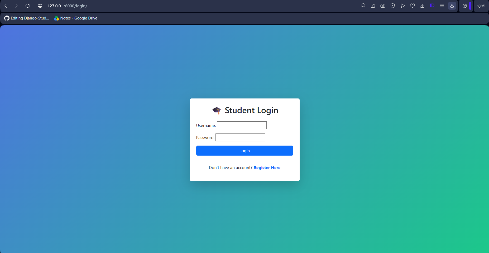
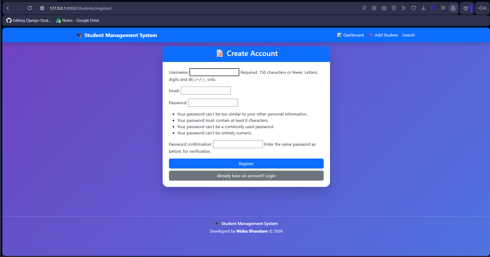
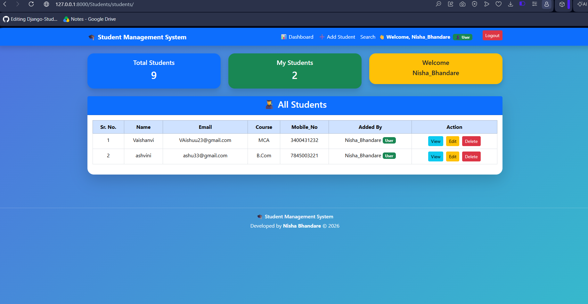
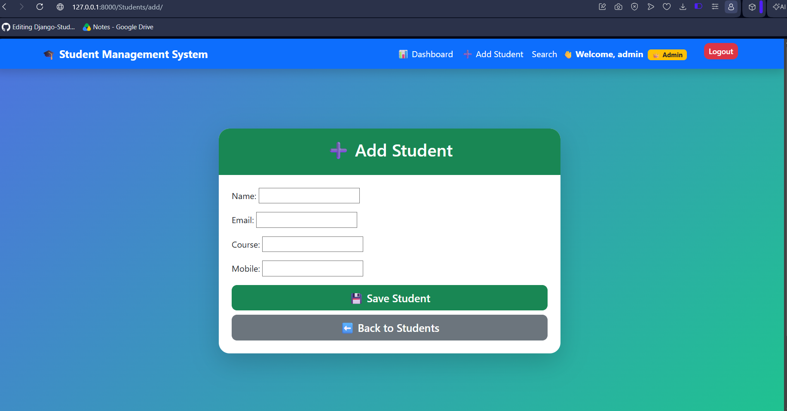
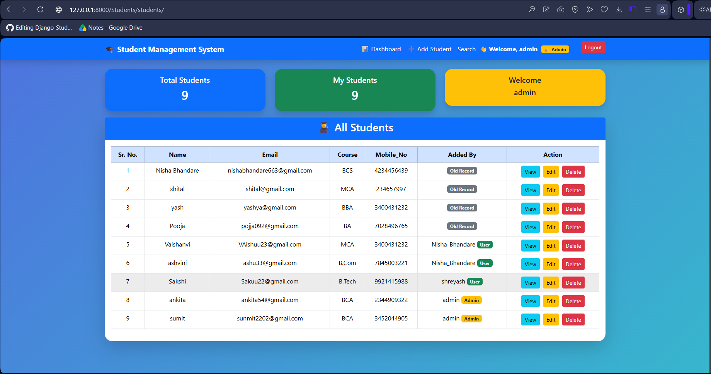
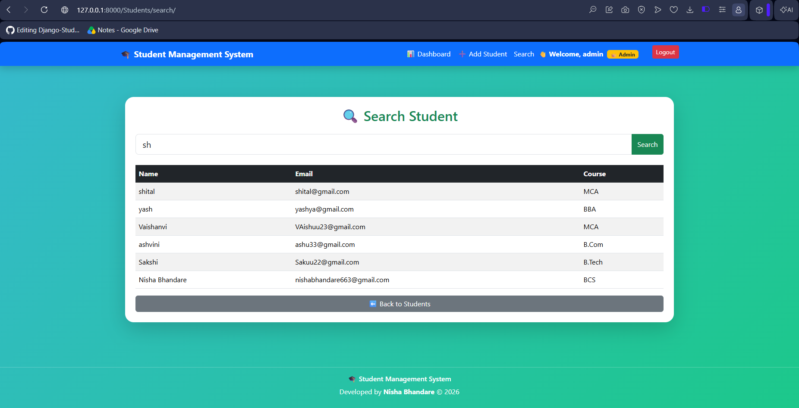
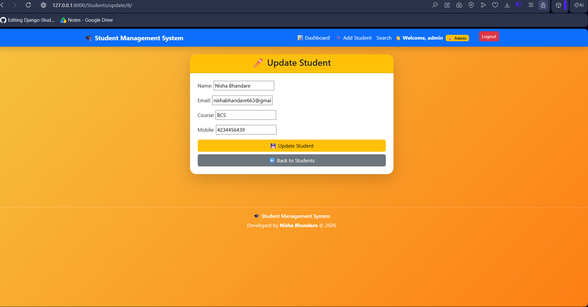
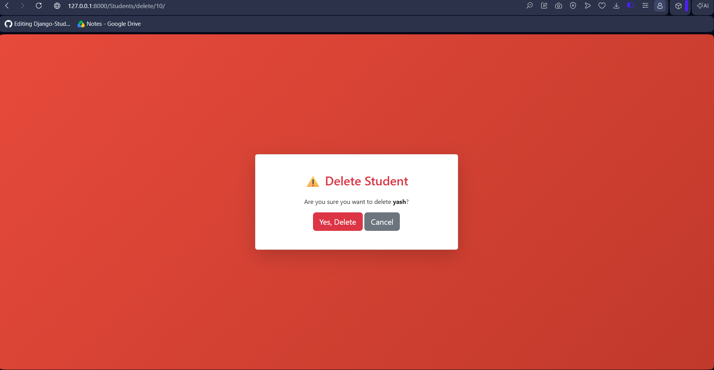

# 🎓 Student Management System

A Django-based Student Management System with Authentication, CRUD Operations, Dashboard, Search, and Role-Based Access Control.

---

## 🚀 Features

- 🔐 User Registration & Login
- 🚪 Logout
- 👤 User Authentication
- 👑 Admin & User Roles
- 👨‍🎓 Add Student
- 📋 View Students
- ✏ Update Student Details
- 🗑 Delete Student
- 🔍 Search Students
- 📊 Dashboard
- 👤 User-wise Student Records
- 💬 Success Messages
- 📱 Responsive Bootstrap UI

---

## 🛠 Technologies Used

- Python
- Django
- HTML5
- CSS3
- Bootstrap 5
- SQLite3

---

## 📂 Project Structure

```
Student_Management_System/
│
├── Student_Management_System/
├── Students/
├── manage.py
├── db.sqlite3
└── README.md
```

---

## ⚙ Installation

Clone the repository

```bash
git clone https://github.com/nishabhandare/Student-Management-System-Django.git
```

Go to project folder

```bash
cd Student-Management-System-Django
```

Install Django

```bash
pip install django
```

Run migrations

```bash
python manage.py migrate
```

Start the development server

```bash
python manage.py runserver
```

Open in browser

```
http://127.0.0.1:8000/
```

---

## 📸 Screenshots

Add your project screenshots here.

- Login Page
- Dashboard
- Add Student
- View Students
- Search Student

---

## 📌 Future Improvements

- Export to PDF
- Export to Excel
- Pagination
- Profile Page
- Change Password

---

## 📸 Project Screenshots

### Login Page


### Registration Page


### User Dashboard


### Admin Dashboard
.png)

### Add Student


### View Students


### Search Student


### Update Student


### Delete Student


---

## 👩‍💻 Developer

**Nisha Bhandare**

GitHub:
https://github.com/nishabhandare

---

⭐ If you like this project, please give it a Star.
